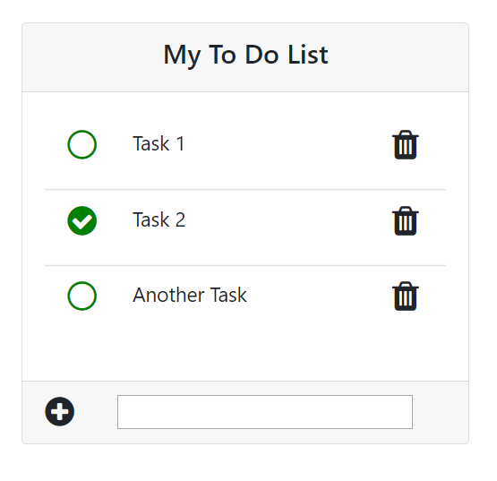

# to-do-list

This is a small web app of a to-do list, created using primarily JavaScript to manipulate the DOM.

A user can add a new to-do task, check off a task as finished, un-check off a task, and delete a task. Furthermore, the program saves the user's tasks so that closing and re-opening the browser doesn't delete any to-do data.

Below is an screenshot of the to-do list web app with a few tasks added.

